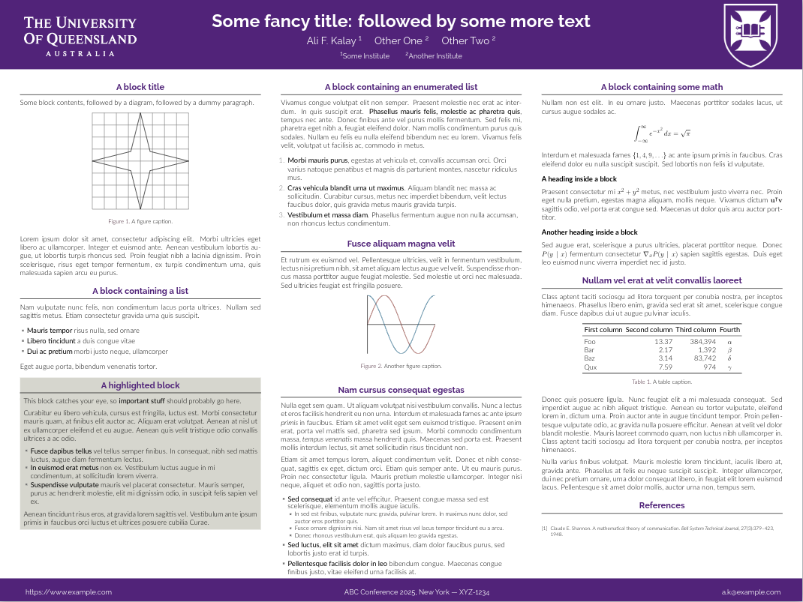

This is a modified [beamerposter](https://ctan.org/pkg/beamerposter?lang=en) template with the University of Queensland logo and colors. It is forked from https://rev.cs.uchicago.edu/k4rtik/gemini-uccs (which is forked from https://github.com/anishathalye/gemini). 

## Screenshot



## UQ RGB

UQ RGB is in file `beamercolorthemeuchicago.sty` can be re-adjusted. The current RGB code is:

```
\definecolor{UQmain}{rgb}{0.3178,0.141,0.478}
```

## Compiling

Refer to [Gemini Readme File](https://github.com/alfurka/gemini-uq/blob/master/gemini-readme.md) for more details.
